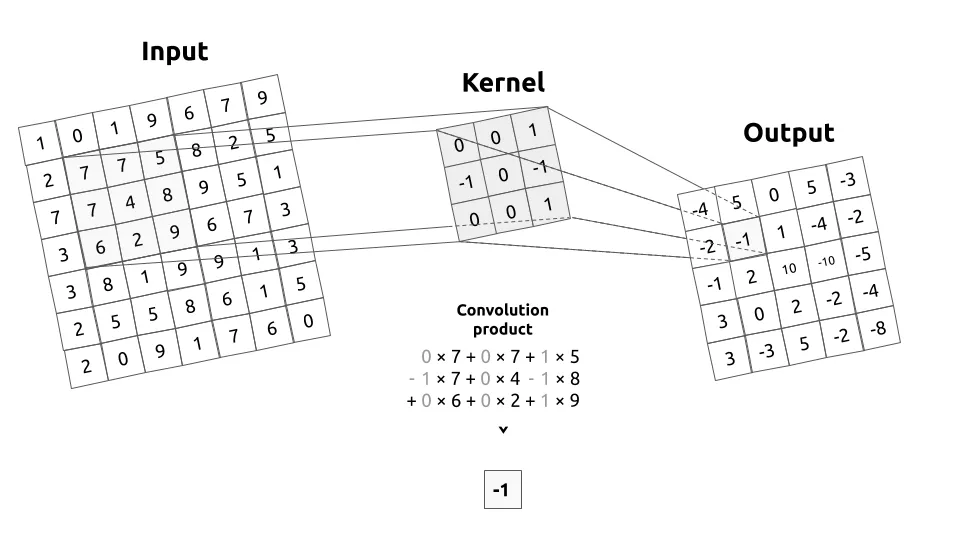
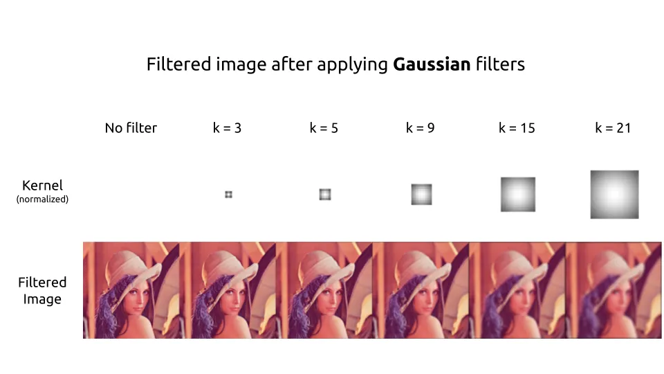
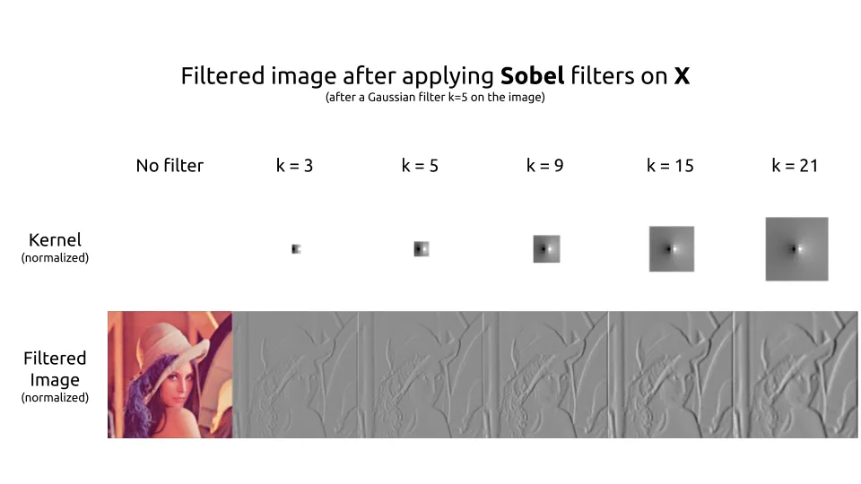
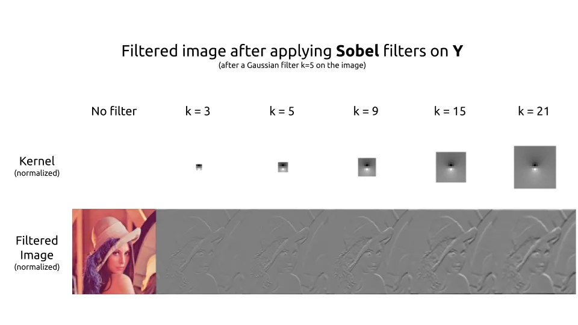
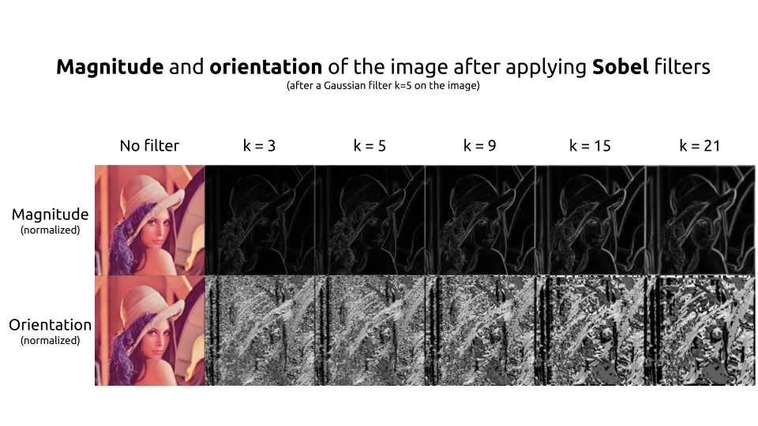
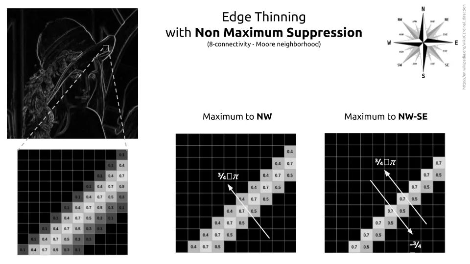
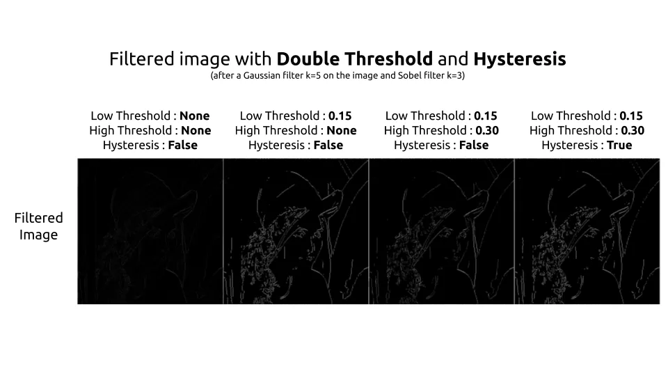

# Implement Canny Edge Detection within Pytorch


The Canny filter is the most known and used filter for edge detection. This experiment will use the canny filter in a multi-stage approach. The Canny filter is rarely integrated into a Deep Learning model. As such, the approach will be explained step-by-step the canny filter for contour detection. Step by step because the canny filter is a multi-stage filter. So I will describe the different parts and at the same time implement it with Pytorch. It can be customized almost without limit, I have allowed myself some deviations.



## Kernel

Convolution is performed between an input image and a kernel. A convolution matrix is used as a filter to be passed over an input image. To make it simple, the kernel will move over the whole image, from left to right, from top to bottom by applying a convolution product. The output of this operation is called a filtered image.


## Gaussian filtering
Need to remove the noise that is present in the input image by applying a blurring filter. There are choices of which filter to apply, but a Gaussian filter is typically used.


Gaussian kernels of different sizes can be made, more or less centered or flattened. The larger the kernel is the more the output image will be blurred.




## Sobel filtering
To detect edges, a filter must be applied to the image to extract the gradients.


Sobel kernel on X

The most commonly used filter is the Sobel filter. Decomposed into two filters, the first kernel is used to extract the gradients horizontally. Roughly speaking, the brighter the pixels on the right are compared to those on the left, the higher the result on the filtered image will be. And vice versa. This can be clearly seen on the left side of Lena’s hat.



Sobel kernel on Y

The second kernel is used to extract the gradients vertically. The one is the transpose of the other. The two cores have the same role but on different axes.




## Compute the gradients
Now the program has the gradients on both axes of our image. To detect the contours, we want to have the magnitude of our gradient. We can use the absolute-value norm or the euclidean norm.


## Magnitude and Orientation of the gradients



The edges are now perfectly detected using the magnitude of our gradients. But they are thick. It would be great if we could keep only the thin lines of the contours. So we compute at the same time the orientation of our gradient which will be used to keep only these thin lines.
In Lena’s images, the gradient is symbolized by intensity as high as the angle of the gradient is important.

## Non-Maximum suppression

For thinning the edges, the Non-Maximum Suppression method can be used. Before doing this kernels of 45° by 45° directions need to be created.


## Directional kernels


The process will, therefore, require to check the 8-neighborhood (or called Moore’s neighborhood). The concept is fairly simple to understand. For each pixel, we will check the orientation.  Need to check and see if this pixel is more intense than its neighbor of its gradient’s direction. If yes, then the pixel is compared with its neighbor in the opposite direction. If this pixel has the maximum intensity compared to its two-directional neighbors, then it is the local maximum. This pixel will be kept. In all other cases, it is not a local maximum and the pixel is removed.




## Thresholds and Hysteresis

Finally, there only remains to apply thresholds. There are three ways of doing this :

Low-High threshold: the pixels with an intensity higher than the threshold are set to 1 and the others to 0.
Low-Weak and Weak-High thresholds: set the pixels with high intensity to 1, the pixels with Low intensity to 0 and between the two thresholds set them to 0.5. They are considered as Weak.
Low-Weak and Weak-High with hysteresis: same as above. Weak pixels are evaluated with their hysteresis level and reassigned as High or Low.


“Hysteresis is the dependence of the state of a system on its history.” — Wikipedia

In our case, hysteresis can be understood as the dependency of a pixel on its neighbors. In the hysteresis step for the canny filter, a Weak pixel will be categorized as High if it has a High neighbor among its 8 neighbors.

In this solution, Weak pixels are characterized using a final convolution filter. If its convolution product is greater than 1 then I categorize it at High. A high neighbor ratio 0.25 points and a Weak half of 0.25.

## Hysteresis kernel


## Pytorch Module

Everything is combined into one nn.Module. It a non-optimzed implementation. Using OpenCV’s features will speed up processing. But this implementation will at least have the advantage of being flexible, parameterizable and easily alterable as needed.




# Setup environment

Run the following commands to setup a python virtual env.

```
python -m venv .venv
pip install virtualenv
.venv\Scripts\activate
[linux]source .venv/bin/activate
pip install -r requirements.txt
```

# Execute Script

To execute the script, type the following command:

python segment.py <your_path_to_the_image>